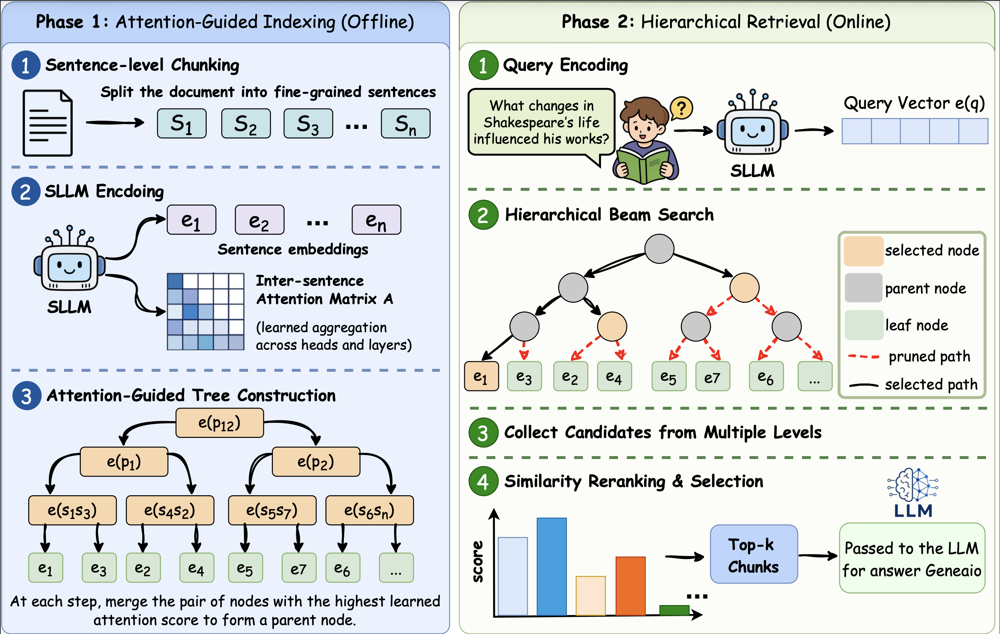

<div align="center">
  <h1>
    
    SproutRAG
    
  </h1>

  <p>
    <a href="https://arxiv.org/pdf/2606.18381">
    
    </a>
    
    
    
    
  </p>
</div>

SproutRAG es un stack de generación aumentada por recuperación diseñado para evidencias estructuradas y de múltiples granularidades. Combina indexación jerárquica basada en atención con recuperación flexible, reranking opcional y pipelines de generación. El resultado es un sistema práctico para construir y evaluar flujos de trabajo de RAG de extremo a extremo.

<p align="center">
  
</p>

## Resumen de Inicio Rápido

Por lo general, seguirás este flujo:

1. Instala el paquete y las dependencias opcionales.
2. Crea o modifica un archivo de configuración (YAML o JSON).
3. Indexa documentos con `sproutrag index`.
4. Ejecuta la recuperación con `sproutrag retrieve`.
5. Genera respuestas con `sproutrag answer`.
6. Entrena el modelo con `sproutrag train` (opcional).
7. Evalúa la recuperación y la generación con `sproutrag evaluate`.

La CLI utiliza configuraciones tipadas para que puedas mantener todo reproducible y fácil de modificar.

## Instalación

Instala en modo editable:

```bash
pip install -e .
```

Extras opcionales:

```bash
pip install -e .[yaml]
pip install -e .[eval]
pip install -e .[spacy]
```

Notas:
- Las configuraciones YAML requieren PyYAML (`.[yaml]`).
- Los extras de evaluación habilitan ROUGE-L, METEOR y BERTScore (`.[eval]`).
- spaCy mejora la división de oraciones (`.[spacy]`).

## Archivos de Configuración

SproutRAG se ejecuta desde archivos de configuración YAML o JSON. La CLI espera una configuración por comando. Puedes comenzar con los ejemplos a continuación y ajustarlos según sea necesario.

### Configuración de Indexación

```yaml
runtime:
  device: null
  seed: 42
  num_workers: 0
  use_cuda_if_available: true

encoder:
  model_name_or_path: sentence-transformers/all-MiniLM-L6-v2
  max_length: 4096
  normalize_embeddings: true
  trust_remote_code: true

aggregator:
  init_strategy: uniform
  mask_diagonal: true

indexing:
  input_path: data/documents.jsonl
  output_dir: indexes
  index_name: demo
  max_sentences_per_chunk: 2
  batch_size: 1
  overwrite: true
```

El archivo de entrada de indexación es JSONL con un documento por línea:

```json
{"doc_id": "doc-1", "text": "Your document text", "title": "Optional title", "metadata": {"source": "example"}}
```

### Configuración de Recuperación

```yaml
runtime:
  device: null
  seed: 42
  num_workers: 0
  use_cuda_if_available: true

encoder:
  model_name_or_path: sentence-transformers/all-MiniLM-L6-v2
  max_length: 4096
  normalize_embeddings: true
  trust_remote_code: true

retrieval:
  index_dir: indexes
  index_name: demo
  query: "How does SproutRAG build the retrieval hierarchy?"
  query_path: null
  output_path: outputs/retrieval.json
  top_k: 10
  per_document_top_k: 5
  beam_width: 5
  threshold: 0.0
  collect_strategy: threshold
  include_root: false
  multi_document: true

reranker:
  enabled: false
  type: none
  model_name_or_path: null
  max_length: 512
  batch_size: 8
  metadata_score_key: null
  trust_remote_code: true
```

### Configuración de Respuesta

```yaml
runtime:
  device: null
  seed: 42
  num_workers: 0
  use_cuda_if_available: true

encoder:
  model_name_or_path: sentence-transformers/all-MiniLM-L6-v2
  max_length: 4096
  normalize_embeddings: true
  trust_remote_code: true

retrieval:
  index_dir: indexes
  index_name: demo
  query: "How does SproutRAG retrieve multi-granularity evidence?"
  query_path: null
  output_path: outputs/answer.json
  top_k: 10
  per_document_top_k: 5
  beam_width: 5
  threshold: 0.0
  collect_strategy: threshold
  include_root: false
  multi_document: true

reranker:
  enabled: false
  type: none
  model_name_or_path: null
  max_length: 512
  batch_size: 8
  metadata_score_key: null
  trust_remote_code: true

context:
  include_scores: true
  include_metadata: false
  include_node_ids: true
  context_separator: "\n\n"
  max_context_chars: 12000

generator:
  type: echo
  model_name_or_path: null
  max_input_length: 4096
  max_new_tokens: 256
  temperature: 0.0
  do_sample: false
  include_system_prompt: true
  system_prompt: null
  trust_remote_code: true
```

### Configuración de Entrenamiento

```yaml
runtime:
  device: null
  seed: 42
  num_workers: 0
  use_cuda_if_available: true

encoder:
  model_name_or_path: sentence-transformers/all-MiniLM-L6-v2
  max_length: 4096
  normalize_embeddings: true
  trust_remote_code: true

aggregator:
  init_strategy: uniform
  mask_diagonal: true

training:
  train_path: data/train.jsonl
  output_dir: runs
  run_name: sproutrag_train
  num_epochs: 3
  batch_size: 32
  max_negatives: null
  require_equal_negatives: true
  learning_rate: 0.00002
  aggregator_learning_rate: 0.001
  weight_decay: 0.0
  warmup_ratio: 0.05
  gradient_clip_norm: 1.0
  checkpoint_every_steps: 100
  log_every_steps: 1
  max_sentences_per_chunk: 2
  normalize_passage_embeddings: true

loss:
  retrieval_temperature: 0.05
  attention_lambda: 0.1
  use_in_batch_negatives: false
  retrieval_reduction: mean
  attention_reduction: mean
  attention_example_reduction: mean
  allow_self_pairs: true
  empty_attention_policy: zero
```

### Configuración de Evaluación de Recuperación

```yaml
runtime:
  device: null
  seed: 42
  num_workers: 0
  use_cuda_if_available: true

encoder:
  model_name_or_path: sentence-transformers/all-MiniLM-L6-v2
  max_length: 4096
  normalize_embeddings: true
  trust_remote_code: true

retrieval:
  index_dir: indexes
  index_name: demo
  query: "dummy"
  query_path: null
  output_path: null
  top_k: 10
  per_document_top_k: 5
  beam_width: 5
  threshold: 0.0
  collect_strategy: threshold
  include_root: false
  multi_document: true

reranker:
  enabled: false
  type: none
  model_name_or_path: null
  max_length: 512
  batch_size: 8
  metadata_score_key: null
  trust_remote_code: true

evaluation:
  task: retrieval
  examples_path: data/retrieval_eval.jsonl
  index_dir: indexes
  index_name: demo
  output_path: outputs/retrieval_eval.json
  ks: [1, 3, 5]
  include_optional_generation_metrics: false
  include_bertscore: false
  bertscore_model_type: null
```

### Configuración de Evaluación de Generación

```yaml
runtime:
  device: null
  seed: 42
  num_workers: 0
  use_cuda_if_available: true

encoder:
  model_name_or_path: sentence-transformers/all-MiniLM-L6-v2
  max_length: 4096
  normalize_embeddings: true
  trust_remote_code: true

retrieval:
  index_dir: indexes
  index_name: demo
  query: "dummy"
  query_path: null
  output_path: null
  top_k: 10
  per_document_top_k: 5
  beam_width: 5
  threshold: 0.0
  collect_strategy: threshold
  include_root: false
  multi_document: true

reranker:
  enabled: false
  type: none
  model_name_or_path: null
  max_length: 512
  batch_size: 8
  metadata_score_key: null
  trust_remote_code: true

context:
  include_scores: true
  include_metadata: false
  include_node_ids: true
  context_separator: "\n\n"
  max_context_chars: 12000

generator:
  type: echo
  model_name_or_path: null
  max_input_length: 4096
  max_new_tokens: 256
  temperature: 0.0
  do_sample: false
  include_system_prompt: true
  system_prompt: null
  trust_remote_code: true

evaluation:
  task: generation
  examples_path: data/generation_eval.jsonl
  index_dir: indexes
  index_name: demo
  output_path: outputs/generation_eval.json
  ks: [1, 3, 5]
  include_optional_generation_metrics: false
  include_bertscore: false
  bertscore_model_type: null
```

## Ejecución de la CLI

### Indexar documentos

```bash
sproutrag index --config configs/index.yaml
```

### Recuperar resultados

```bash
sproutrag retrieve --config configs/retrieve.yaml
```

### Responder consultas

```bash
sproutrag answer --config configs/answer.yaml
```

### Entrenar

```bash
sproutrag train --config configs/train.yaml
```

### Evaluar recuperación

```bash
sproutrag evaluate --config configs/evaluate_retrieval.yaml
```

### Evaluar generación

```bash
sproutrag evaluate --config configs/evaluate_generation.yaml
```

### Anular valores de configuración desde la CLI

```bash
sproutrag retrieve \
  --config configs/retrieve.yaml \
  --override retrieval.top_k=20 \
  --override retrieval.beam_width=8
```

## Notas

- Todas las salidas son JSON para una fácil integración con herramientas posteriores.
- Mantén las configuraciones en control de versiones para que las ejecuciones sean reproducibles.
- Para el entrenamiento con MS MARCO, el pipeline de entrenamiento actualmente carga los primeros 30k ejemplos de la división de entrenamiento v2.1.

## Citación
```
@misc{abaskohi2026sproutragattentionguidedtreesearch,
      title={SproutRAG: Attention-Guided Tree Search with Progressive Embeddings for Long-Document RAG}, 
      author={Amirhossein Abaskohi and Issam H. Laradji and Peter West and Giuseppe Carenini},
      year={2026},
      eprint={2606.18381},
      archivePrefix={arXiv},
      primaryClass={cs.CL},
      url={https://arxiv.org/abs/2606.18381}, 
}
```
